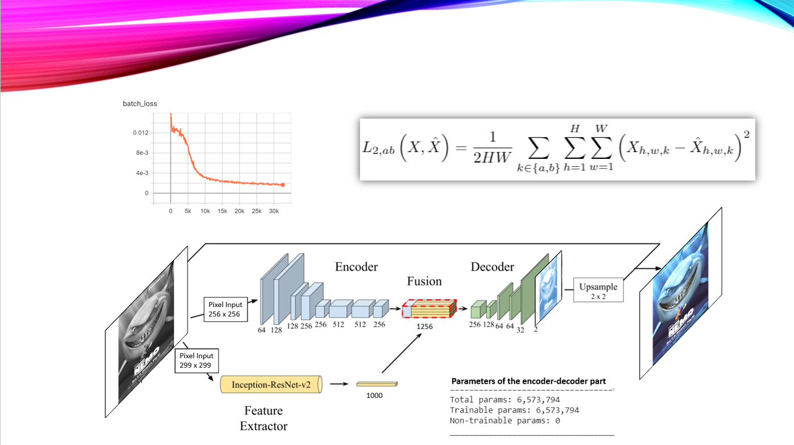
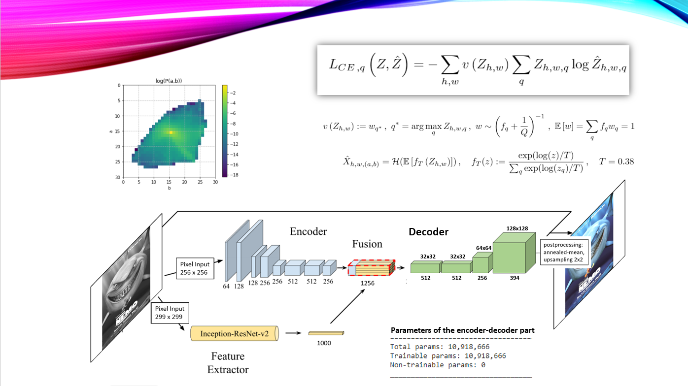
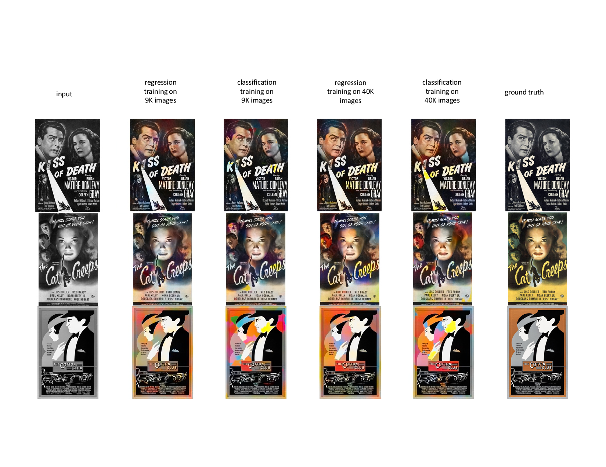
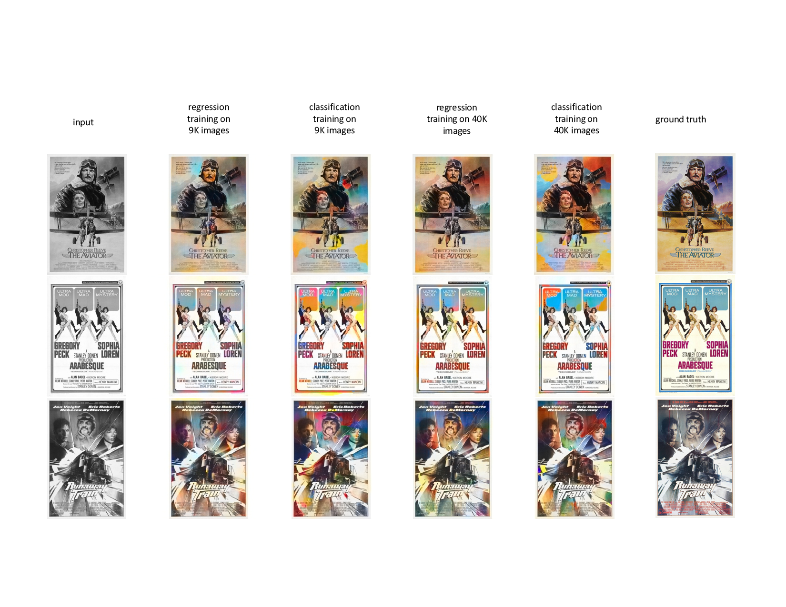

# RecolorizationProject
### Introduction

The motivation for this work arises from my observation of an increasing interest in screening events of old movies.
The focus lies on recoloring of movie posters between old and modern color schemes. Refreshed colors could be a promising approach for attracting new audience to screening events of old classics in movie theaters. Following that, the input is a colored RGB image, more specifically a movie poster, which is then transformed to a grey-scaled image and is recolored by a CNN encoder-decoder architecture within the CIELAB color space. The output image is then obtained by transforming back to RGB channels.

The training of the network is studied with respect to two different loss functions. The objective function of the first model is minimized with respect to the L2 loss between the output pixels and the ground truth pixels per color channel of the CIELAB color space. The objective function of the second model is minimized with respect to the multinomial cross-entropy loss between the output layer with a depth of 394 color classes and the corresponding soft-encoding scheme of the ground truth representation. Here, the final result is obtained by transforming the 394 color classes to the corresponding a,b outputs in CIELAB space and adding them to the L-channel, containing the grey-scaled information of the image.

## See [final report](./AlexMeistrenko_CS230_Fall_2020_FinalReport.pdf), [presentation](./Automatic%20recolorization.pdf) and [YouTube-Video](https://www.youtube.com/watch?v=r_I2p61o_fk&t=1s) for a detailed description of the implementation, chosen hyperparameters and metrics. 

### 1. [regression model](./content/RecolorizationEncDecIResNet_regressionModel.ipynb)
The underlying autoencoder model with regression loss is mainly based on the Refs. [1,2].

<kbd></kbd>

### 2. [color-classification model](./content/RecolorizationEncDecIResNet_colorClassificationModel.ipynb)
Here, I replaced the decoder part of the original model to an output volume with 394 different color classes for a, b chanells of the CIELAB color space. The cross-entropy loss accounts for the class imbalance problem by reweighting the loss w.r.t. rare pixel colors as it was done in Ref. [3].

<kbd></kbd>

## Results

Both regression and classification models show a decent performance in recoloring the old movie posters. Especially, in case of the classification model the results are very colorful and brighter than the original images. In comparison to the results of the [final report](./AlexMeistrenko_CS230_Fall_2020_FinalReport.pdf) I also included the results obtained for the classification model and 40K training images, requiring an additional week of training time.   

<kbd></kbd>
<kbd></kbd>
<kbd></kbd>

### Main References:

[1] [Deep-Koalarization: Image Colorization using CNNs and Inception-ResNet-v2, by Federico Baldassarre, Diego Gonzalez Morín and Lucas Rodés-Guirao](https://github.com/baldassarreFe/deep-koalarization)

[2] [Colorizing Black and White Images with Neural Networks, by Emil Wallner](https://github.com/emilwallner/Coloring-greyscale-images)

[3] [Colorful Image Colorization, by Richard Zhang, Phillip Isola and Alexei A. Efros](https://richzhang.github.io/colorization/)

### Further References (see final report):

[Colorization using optimization](https://doi.org/10.1145/1015706.1015780)

[An adaptive edge detection based colorization algorithm and its applications](https://doi.org/10.1145/1101149.1101223)

[Let there be color!: joint end-to-end learning of global and local image priors for automatic image colorization with simultaneous classification](https://doi.org/10.1145/2897824.2925974)

[Learning Representations for Automatic Colorization](https://link.springer.com/chapter/10.1007/978-3-319-46493-0_35)

[Inception-v4, inception-ResNet and the impact of residual connections on learning](https://dl.acm.org/doi/10.5555/3298023.3298188)

[Perceptual Losses for Real-Time Style Transfer and Super-Resolution](https://www.springerprofessional.de/perceptual-losses-for-real-time-style-transfer-and-super-resolut/10708994)

[Pixel-level Semantics Guided Image Colorization](http://bmvc2018.org/contents/papers/0236.pdf)

[ChromaGAN: Adversarial Picture Colorization with Semantic Class Distribution](https://ieeexplore.ieee.org/document/9093389)

[Line Drawing Colorization](http://cs231n.stanford.edu/reports/2017/pdfs/425.pdf)

[AutoColorization of Monochrome Images](http://cs231n.stanford.edu/reports/2017/pdfs/418.pdf)

[Exploring Convolutional Neural Networks for Automatic Image Colorization](http://cs231n.stanford.edu/reports/2017/pdfs/409.pdf)

[Image Colorization Using Generative Adversarial Networks](https://github.com/ImagingLab/Colorizing-with-GANs)

[Automatic Image Colorization Via Multimodal Predictions](https://link.springer.com/chapter/10.1007/978-3-540-88690-7_10)

