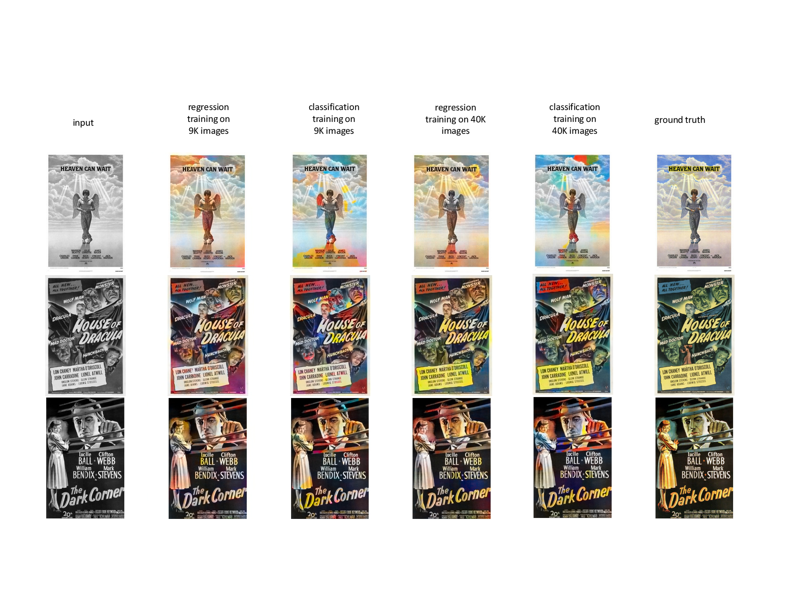

# RecolorizationProject
- the underlying autoencoder model with regression loss is mainly based on the Refs. 

- read final report for a detailed description of the 

final results

[] Colorization using optimization, https://doi.org/10.1145/1015706.1015780
[] An adaptive edge detection based colorization algorithm and its applications, https://doi.org/10.1145/1101149.1101223
[] Let there be color!: joint end-to-end learning of global and local image priors for automatic image colorization with simultaneous classification, https://doi.org/10.1145/2897824.2925974
[] Learning Representations for Automatic Colorization, https://link.springer.com/chapter/10.1007/978-3-319-46493-0_35
[] Inception-v4, inception-ResNet and the impact of residual connections on learning, https://dl.acm.org/doi/10.5555/3298023.3298188
[] Deep-Koalarization: Image Colorization using CNNs and Inception-ResNet-v2, https://arxiv.org/abs/1712.03400, https://github.com/baldassarreFe/deep-koalarization
[] Perceptual Losses for Real-Time Style Transfer and Super-Resolution, https://www.springerprofessional.de/perceptual-losses-for-real-time-style-transfer-and-super-resolut/10708994
[] Pixel-level Semantics Guided Image Colorization, http://bmvc2018.org/contents/papers/0236.pdf
[] ChromaGAN: Adversarial Picture Colorization with Semantic Class Distribution, https://ieeexplore.ieee.org/document/9093389
[] 
